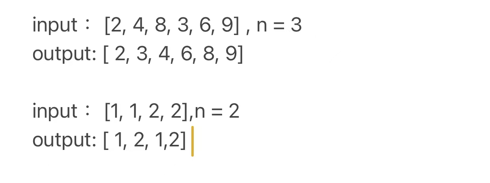

# forLaoQiShi

给某L姓氏圣骑在wv群提问的解答

根据这个图片，只是属于重新排列array类型的题目。
基本上，排列array的题目，只要搞懂排列规律还有知道border case会是什么样的离答案就不远了。

这个问题的排列规律有二：
1. 能被n除于整的数字，如果可以，要用一个数字隔开
2. 在不影响1的前提下，按照数字从小到大进行排列。
         
Border Case (边缘数据) :
1. n是负
2. n是零
3. n是1
4. n比array所有数字大
5. array是空的
   i.asda
7. n是空的
